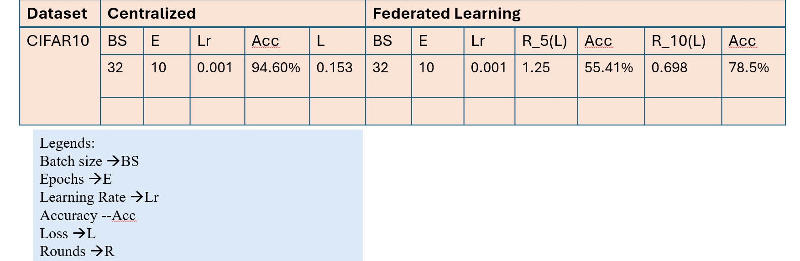

How to run the code of CIFAR10 datasets Federated Learning
1. run: py cifar_server.py
2. in three different terminals: 
				 run py cifar_main.py --cliend_id 0 --num_clinets 3
				 run py cifar_main.py --cliend_id 1 --num_clinets 3
				 run py cifar_main.py --cliend_id 2 --num_clinets 3

For running the evaluation Part: 
python main.py --role server --num_clients 3 --epochs 5

python main.py --role client --cid 0 --num_clients 3 --batch_size 32
python main.py --role client --cid 1 --num_clients 3 --batch_size 32
python main.py --role client --cid 2 --num_clients 3 --batch_size 32

The comparasion table for both Centralized and Federated Learning performance accuracy

